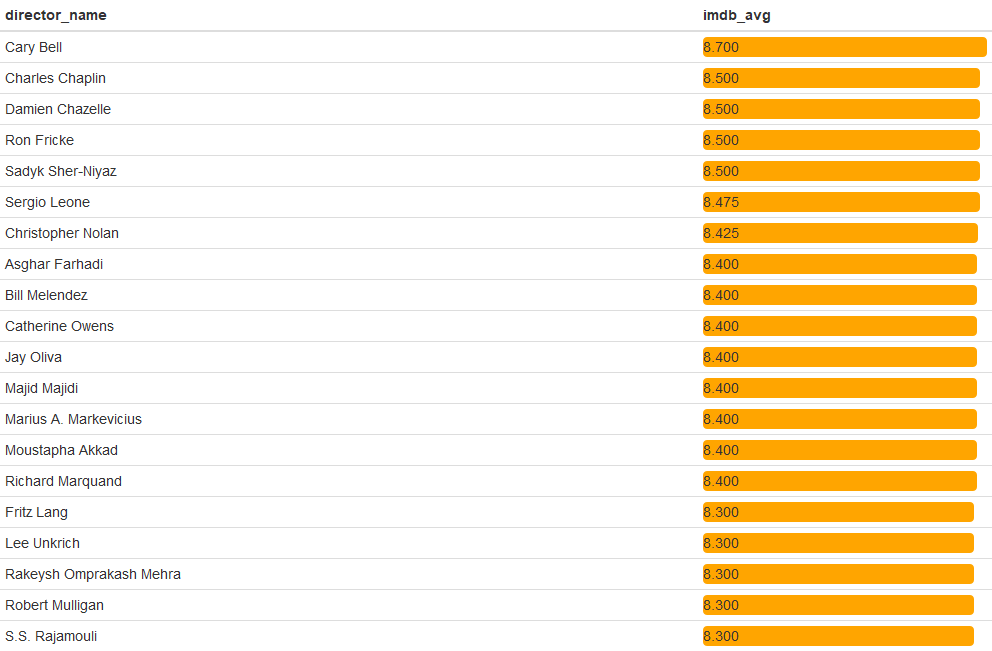
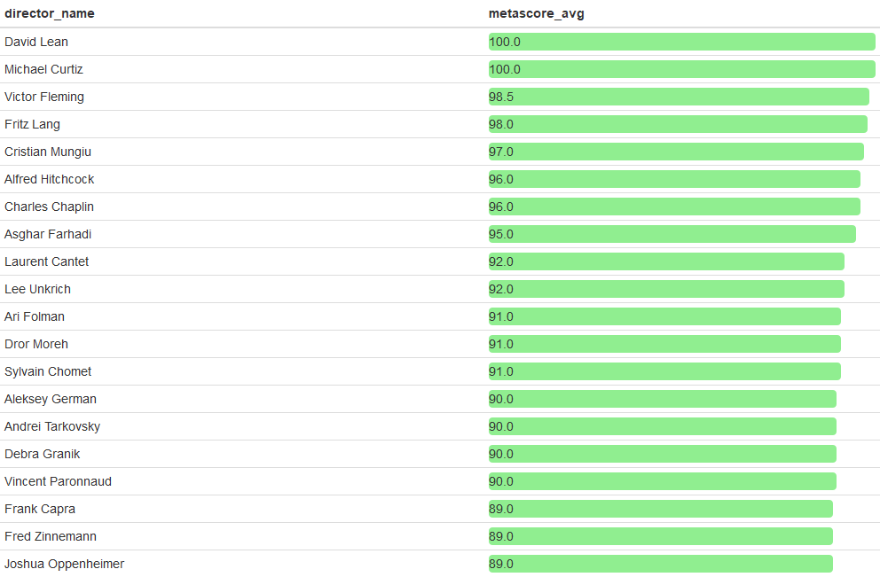
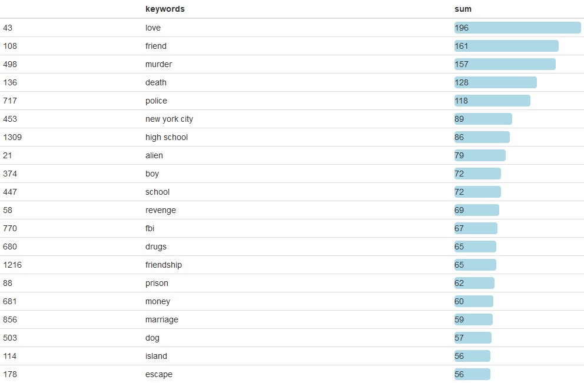
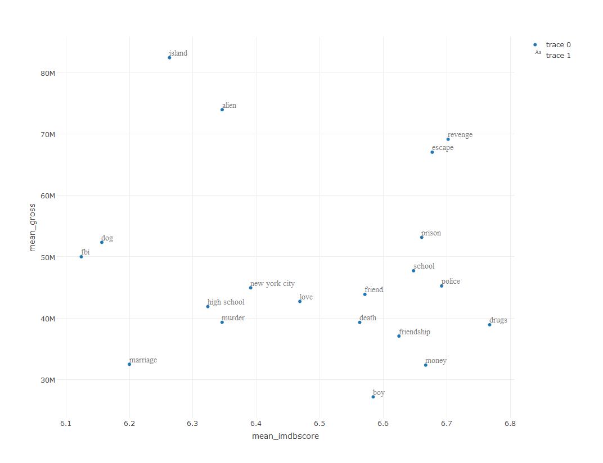
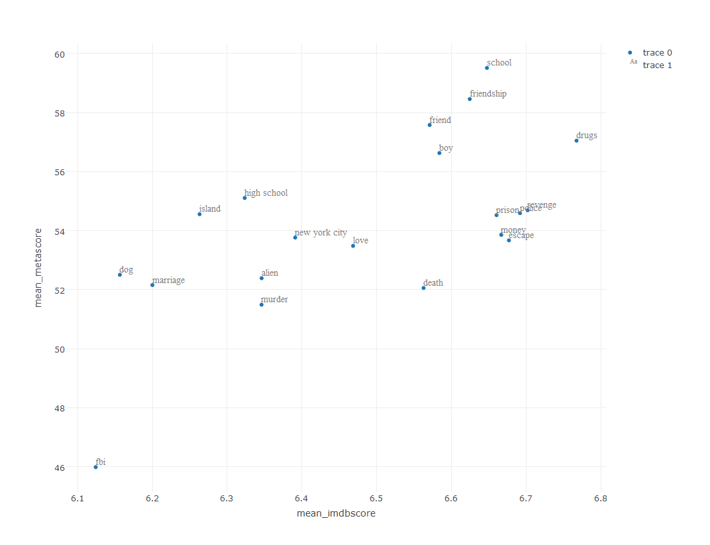
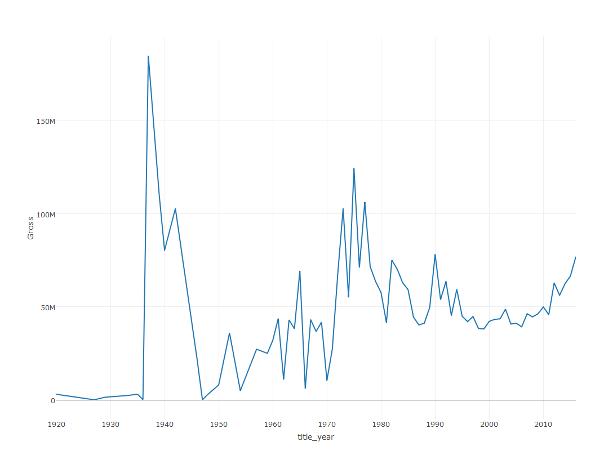

IMDB Movie Analysis
================
Hannah
June 21, 2017

資料介紹
--------

1.  來源： 從Kaggle載入IMDB 5000 movies dataset (source:<https://www.kaggle.com/deepmatrix/imdb-5000-movie-dataset>) ，並利用dataset中提供的每個IMDB link 抓取每筆電影在IMDB網站上的最新IMDB rating、rating的人數、User review的人數、Critic review的人數，和抓取原本dataset裡沒有的Metacritic網站評分數(metascore)。
2.  格式： 檔案儲存類型為CSV檔。電影資料共5043筆，清洗掉title\_year為NA的電影資料(年分為NA值可能尚未上映)，剩下4935筆資料。欄位包括：電影名稱、電影長度、電影分級、預算、總收益、語言、國家、導演名稱、三名主要演員名稱、電影FB粉絲團人數、導演FB粉絲團人數、三位主要演員個別粉絲團人數、演員總粉絲團人數、IMDB Score、Metascore、一般網民影評數、專業影評人影評數、IMDB link等。

分析議題
--------

現在的電影越出越多，出續集的速度也非常的快，常常續集每隔一年就能產出。有些電影會以強大的演員卡司陣容，或強大的特效技術等，來吸引更多的消費者願意掏錢去電影院觀看。 IMDB、Metacritic、Rotten Tomato，皆為國外廣為人知的電影資訊與評論網站，但是其性質及使用客群並不相同。IMDB大多皆為一般網民評分，較少專業影評人評分；Metacritic的評分則是以一群專業影評人給分的加權平均數計算。

假設與想了解的問題
==================

1.  假設Metacritic Score 和 IMDB Score 會有很大的差異性
2.  假設近年電影的平均評價相較早年來得低
3.  假設在電影分級中，普遍級(G)電影的IMDB score和metascore普遍較高
4.  哪些導演拍的電影得到的平均IMDB/Metascore評分比較高
5.  假設電影卡司越受歡迎，總收益越高
6.  假設劇情較重口味、黑暗、或刺激類型的電影比較多
7.  假設電影總收益有增加的趨勢

分析結果
========

1.  比較IMDB和Metacritic評分之間的相關性，發現相關性呈現高度正相關，所以其實兩者相差並沒有太大。

``` r
library(readr)
```

    ## Warning: package 'readr' was built under R version 3.3.3

``` r
movie_metadata_latest3 <- read_csv("movie_metadata_latest3.csv", locale = locale(encoding = "ASCII"))
```

    ## Warning: Missing column names filled in: 'X1' [1]

    ## Parsed with column specification:
    ## cols(
    ##   .default = col_integer(),
    ##   color = col_character(),
    ##   director_name = col_character(),
    ##   actor_2_name = col_character(),
    ##   genres = col_character(),
    ##   actor_1_name = col_character(),
    ##   movie_title = col_character(),
    ##   actor_3_name = col_character(),
    ##   plot_keywords = col_character(),
    ##   movie_imdb_link = col_character(),
    ##   language = col_character(),
    ##   country = col_character(),
    ##   content_rating = col_character(),
    ##   imdb_score = col_double()
    ## )

    ## See spec(...) for full column specifications.

``` r
movie_metadata<-movie_metadata_latest3[!is.na(movie_metadata_latest3$title_year),]
library(dplyr)
```

    ## Warning: package 'dplyr' was built under R version 3.3.3

    ## 
    ## Attaching package: 'dplyr'

    ## The following objects are masked from 'package:stats':
    ## 
    ##     filter, lag

    ## The following objects are masked from 'package:base':
    ## 
    ##     intersect, setdiff, setequal, union

``` r
score_clean<-movie_metadata[!is.na(movie_metadata$metascore),]
cor_imdb_meta<-summarise(score_clean,"cor_imdb_metascore"=cor(score_clean$imdb_score,score_clean$metascore))
knitr::kable(cor_imdb_meta)
```

cor\_imdb\_metascore
--------------------

          0.7522313

依電影內容分級來比較IMDB Score和Metascore之間的相關性 從結果可以發現電影內容分級為NC-17級的電影IMDB Score和Metascore相關性最高，第二高為G，相關性最低的則為R。 所以可以推測專業影評人和一般網民對於NC-17和G級的電影評價差異並不大，而對R級電影評價則稍微較有出入。

``` r
score_clean$content_rating[score_clean$content_rating=='TV-14']<-NA
score_rating_clean<-score_clean[!is.na(score_clean$content_rating),]
cor_imdb_meta_byRating<-group_by(score_rating_clean,content_rating)%>%summarise(cor_imdb_metascore=cor(imdb_score,metascore))
knitr::kable(cor_imdb_meta_byRating)
```

| content\_rating |  cor\_imdb\_metascore|
|:----------------|---------------------:|
| G               |             0.8151201|
| NC-17           |             0.9740276|
| PG              |             0.7743827|
| PG-13           |             0.7537809|
| R               |             0.7356489|

1.  分析每年電影的IMDB Score和Metascore的趨勢，來看是否電影的評價逐年下降

``` r
score_year<-group_by(score_clean,title_year)%>%summarise(movie_count=n(),imdb_score=mean(imdb_score),metascore=mean(metascore))
knitr::kable(score_year)
```

|  title\_year|  movie\_count|  imdb\_score|  metascore|
|------------:|-------------:|------------:|----------:|
|         1927|             1|     8.300000|   98.00000|
|         1936|             1|     8.500000|   96.00000|
|         1939|             2|     8.150000|   98.50000|
|         1942|             1|     8.500000|  100.00000|
|         1946|             1|     8.600000|   89.00000|
|         1950|             1|     7.000000|   77.00000|
|         1952|             1|     8.000000|   89.00000|
|         1954|             2|     8.450000|   93.00000|
|         1957|             1|     8.900000|   96.00000|
|         1960|             1|     8.500000|   96.00000|
|         1962|             1|     8.300000|  100.00000|
|         1964|             3|     8.100000|   93.00000|
|         1965|             1|     6.800000|   62.00000|
|         1966|             1|     8.900000|   90.00000|
|         1967|             1|     8.000000|   89.00000|
|         1968|             2|     8.450000|   83.00000|
|         1969|             2|     8.000000|   68.50000|
|         1970|             2|     8.050000|   95.50000|
|         1971|             2|     7.800000|   96.00000|
|         1972|             2|     8.650000|   95.00000|
|         1973|             2|     8.150000|   81.00000|
|         1974|             6|     7.950000|   79.00000|
|         1975|             3|     8.333333|   86.33333|
|         1976|             3|     8.166667|   83.33333|
|         1977|             3|     7.700000|   79.66667|
|         1978|            10|     7.690000|   77.40000|
|         1979|             8|     7.200000|   67.62500|
|         1980|            14|     7.500000|   66.00000|
|         1981|             9|     7.322222|   70.66667|
|         1982|            15|     7.240000|   64.80000|
|         1983|            13|     6.946154|   55.15385|
|         1984|            11|     7.363636|   67.27273|
|         1985|             8|     7.400000|   74.25000|
|         1986|             8|     7.212500|   66.00000|
|         1987|            14|     6.664286|   55.21429|
|         1988|            16|     7.062500|   59.87500|
|         1989|            17|     7.205882|   63.05882|
|         1990|            17|     7.264706|   61.29412|
|         1991|            14|     7.200000|   63.92857|
|         1992|            19|     7.194737|   65.10526|
|         1993|            20|     7.370000|   68.95000|
|         1994|            31|     7.161290|   62.96774|
|         1995|            45|     6.855556|   60.71111|
|         1996|            50|     6.770000|   59.66000|
|         1997|            84|     6.652381|   59.13095|
|         1998|            98|     6.694898|   56.94898|
|         1999|           160|     6.460000|   52.55625|
|         2000|           168|     6.267857|   49.59524|
|         2001|           188|     6.310106|   49.19149|
|         2002|           202|     6.320792|   52.62376|
|         2003|           160|     6.320000|   52.16875|
|         2004|           202|     6.475743|   53.23762|
|         2005|           207|     6.406280|   55.17391|
|         2006|           216|     6.444444|   55.88889|
|         2007|           174|     6.598276|   56.25287|
|         2008|           196|     6.388265|   52.72449|
|         2009|           217|     6.424885|   54.01382|
|         2010|           200|     6.370000|   53.16500|
|         2011|           199|     6.376382|   54.65327|
|         2012|           183|     6.473224|   55.16393|
|         2013|           191|     6.501047|   54.62827|
|         2014|           202|     6.282178|   51.66832|
|         2015|           165|     6.272727|   51.21212|
|         2016|            94|     6.160638|   49.57447|

為了方便IMDB Score和Metascore兩者之間的比較，先將IMDB Score換成百分制計算。 由結果可發現每年平均電影評分的確有下降的趨勢，尤其是Metascore下降的幅度最大。 推測是由於近年電影產量越來越多，品質參差不齊，另外則是由於IMDB網站創立年分為1990年而Metacritic則為1999年，可能網民比較會注意的是近期的電影，早期的電影比較少人會去給予評分或評論，若有給評分或評論可能會因為是經典老片或是評分者覺得這部電影非常值得再看，而會去專門到IMDB的那部電影的頁面下給予較高的評分。

``` r
library(plotly)
```

    ## Loading required package: ggplot2

    ## Warning: package 'ggplot2' was built under R version 3.3.3

    ## 
    ## Attaching package: 'plotly'

    ## The following object is masked from 'package:ggplot2':
    ## 
    ##     last_plot

    ## The following object is masked from 'package:stats':
    ## 
    ##     filter

    ## The following object is masked from 'package:graphics':
    ## 
    ##     layout

``` r
score_year$imdb_score<-score_year$imdb_score*10
export(plot_ly(score_year, x = ~title_year, y = ~imdb_score, type = 'scatter', mode='line', name = 'imdb_score') %>%
    add_trace(y = ~metascore, name = 'metascore') %>%
    layout(yaxis = list(title = 'Score')))
```

    ## A line object has been specified, but lines is not in the mode
    ## Adding lines to the mode...

    ## A line object has been specified, but lines is not in the mode
    ## Adding lines to the mode...
    ## A line object has been specified, but lines is not in the mode
    ## Adding lines to the mode...
    ## A line object has been specified, but lines is not in the mode
    ## Adding lines to the mode...
    ## A line object has been specified, but lines is not in the mode
    ## Adding lines to the mode...
    ## A line object has been specified, but lines is not in the mode
    ## Adding lines to the mode...


1.  分析哪種內容分級的電影在IMDB評分最高： 由結果可以發現R和PG-13級的電影評分懸殊最大，G和NC-17的評分分布較沒有這麼大，所以推測可能普遍級的電影評分較。而整體電影評分NC-17和G級電影較高。所以推測可能普遍級的電影評分較中規中矩，而限制級NC-17的電影可能因為數量較少，所以評分分布較小。

``` r
movie_content_rating<- movie_metadata[which(movie_metadata$content_rating== "NC-17"
                                    | movie_metadata$content_rating == "R" 
                                    | movie_metadata$content_rating == "PG-13" 
                                    | movie_metadata$content_rating == "PG"
                                    | movie_metadata$content_rating == "G"), ]

export(plot_ly(movie_content_rating, y = ~content_rating, x = ~imdb_score,
        type = "box", orientation = "h"))
```


分析哪種內容分級的電影在Metascritic評分最高： R、PG-13、PG級的電影評分分布依然很大，整體評分較高的也是NC-17和G級的電影。

``` r
movie_content_rating2<- score_clean[which(score_clean$content_rating== "NC-17"
                                    | score_clean$content_rating == "R" 
                                    | score_clean$content_rating == "PG-13" 
                                    | score_clean$content_rating == "PG"
                                    | score_clean$content_rating == "G"), ]

export(plot_ly(movie_content_rating2, y = ~content_rating, x = ~metascore,
        type = "box", orientation = "h"))
```


1.  分析哪些導演拍的電影得到的平均IMDB評分比較高

``` r
temp<-movie_metadata%>%select(director_name,imdb_score)
temp <-temp %>% group_by(director_name) %>% summarise(imdb_avg=mean(imdb_score))
temp <- temp %>% arrange(desc(imdb_avg))
temp <- head(temp,20)
library(formattable)
```

    ## Warning: package 'formattable' was built under R version 3.3.3

    ## 
    ## Attaching package: 'formattable'

    ## The following object is masked from 'package:plotly':
    ## 
    ##     style

``` r
library("htmltools")
```

    ## Warning: package 'htmltools' was built under R version 3.3.3

``` r
library("webshot")    
```

    ## Warning: package 'webshot' was built under R version 3.3.3

``` r
export_formattable <- function(f, file, width = "100%", height = NULL, 
                               background = "white", delay = 0.2)
    {
      w <- as.htmlwidget(f, width = width, height = height)
      path <- html_print(w, background = background, viewer = NULL)
      url <- paste0("file:///", gsub("\\\\", "/", normalizePath(path)))
      webshot(url,
              file = file,
              selector = ".formattable_widget",
              delay = delay)
    }
img<-temp %>% formattable(list(imdb_avg = color_bar("orange")), align = 'l')
export_formattable(img,"director_imdbscore.png")
```



分析哪些導演拍的電影得到的平均Metascore評分比較高

``` r
temp<-score_clean%>%select(director_name,metascore)
temp <-temp %>% group_by(director_name) %>% summarise(metascore_avg=mean(metascore))
temp <- temp %>% arrange(desc(metascore_avg))
temp <- head(temp,20)
img2<-temp %>% formattable(list(metascore_avg = color_bar("lightgreen")), align = 'l')
export_formattable(img2,"director_metascore.png")
```



1.  分析是否電影卡司越受歡迎，總收益越好 從結果可以發現總收益較高的Avatar 和 Jurassic World 所有演員FB粉絲團人數最低，推測是由於電影主打的是以後製動畫特效為主，與演員受歡迎程度無關。 所有演員FB粉絲團人數較高的Anchorman: The Legend of Ron Burgundy和The Final Destination，反而總收益並有沒很好。 另外Titanic的總收益也偏高，但是粉絲團人數卻不多，推測是由於電影年代較早期，早期演員可能比較沒有建立粉絲團。

``` r
temp<-movie_metadata%>%select(movie_title,title_year,cast_total_facebook_likes,gross,imdb_score,metascore)
temp$movie_title<-sub("^\\s*<U\\+\\w+>\\s*", "", temp$movie_title)

export(plot_ly(temp, x = ~gross, y = ~cast_total_facebook_likes, type = 'scatter', mode='marker', text =~paste(movie_title,title_year)))
```

    ## Warning: Ignoring 779 observations

    ## A marker object has been specified, but markers is not in the mode
    ## Adding markers to the mode...

    ## Warning: Ignoring 779 observations

    ## A marker object has been specified, but markers is not in the mode
    ## Adding markers to the mode...

    ## Warning: Ignoring 779 observations

    ## A marker object has been specified, but markers is not in the mode
    ## Adding markers to the mode...


1.  分析電影劇情keywords前20名 從結果可以發現電影劇情最受歡迎的有：溫馨路線(love、friend、friendship、marriage)，重口味(murder、death)、外星人(alien)、偵查辦案(police、prison、drugs、FBI)、學校(school、high school)、動作片(escape)等。 結果與假設不同，電影類型最多的兩個皆是較走溫馨路線。

``` r
temp<-movie_metadata%>%select(movie_title,gross,imdb_score,metascore,plot_keywords)
movies0<-temp[temp$plot_keywords!="",]
keywords<-c()
i<-1
for(n in movies0$plot_keywords){
  k<-strsplit(n,"[|]")
  if(length(k)!=0){
    for(word in k[[1]]){
      if(!(word%in%keywords)){
        keywords[i]<-word
        i=i+1
      }
    }
  }
}
movies0$plot_keywords <- strsplit(movies0$plot_keywords, "[|]")
keywords_idx <- movies0%>%select(movie_title,plot_keywords)
i = 1
mat<- matrix(rep(0, (dim(movies0)[1] * length(keywords))), nrow = dim(movies0)[1])
for (word in keywords_idx$plot_keywords){
    idx <- which(keywords %in% word)
    mat[i, idx] <- 1
    i = i + 1
}
colnames(mat) <- keywords
movies_and_keywords <- data.frame(mat)

sum <- rep(0, length(keywords))
for (i in 1:length(keywords)){
    sum[i] <- sum(movies_and_keywords[, i])
}
keywords_sum <- data.frame(keywords = factor(keywords), sum = sum)
keywords_sum <- keywords_sum[order(sum, decreasing = TRUE),]
keywords_sum<-na.omit(keywords_sum)
top_keywords<-head(keywords_sum, 20)
img3<-(top_keywords%>% formattable(list(sum = color_bar("lightblue")), align = 'l'))
export_formattable(img3,"keywordsTop20.png")
```



Plot keywords wordcloud

``` r
library(wordcloud)
```

    ## Warning: package 'wordcloud' was built under R version 3.3.3

    ## Loading required package: RColorBrewer

``` r
wordcloud(words = keywords_sum$keywords,freq = keywords_sum$sum, scale = c(6,0.3), random.order=FALSE, max.words = 50, colors = brewer.pal(7, "Dark2"))
```

    ## Warning in wordcloud(words = keywords_sum$keywords, freq = keywords_sum
    ## $sum, : female protagonist could not be fit on page. It will not be
    ## plotted.

    ## Warning in wordcloud(words = keywords_sum$keywords, freq = keywords_sum
    ## $sum, : teenager could not be fit on page. It will not be plotted.

    ## Warning in wordcloud(words = keywords_sum$keywords, freq = keywords_sum
    ## $sum, : hospital could not be fit on page. It will not be plotted.

    ## Warning in wordcloud(words = keywords_sum$keywords, freq = keywords_sum
    ## $sum, : serial killer could not be fit on page. It will not be plotted.

    ## Warning in wordcloud(words = keywords_sum$keywords, freq = keywords_sum
    ## $sum, : female nudity could not be fit on page. It will not be plotted.

    ## Warning in wordcloud(words = keywords_sum$keywords, freq = keywords_sum
    ## $sum, : christmas could not be fit on page. It will not be plotted.

    ## Warning in wordcloud(words = keywords_sum$keywords, freq = keywords_sum
    ## $sum, : lawyer could not be fit on page. It will not be plotted.

    ## Warning in wordcloud(words = keywords_sum$keywords, freq = keywords_sum
    ## $sum, : college could not be fit on page. It will not be plotted.

    ## Warning in wordcloud(words = keywords_sum$keywords, freq = keywords_sum
    ## $sum, : best friend could not be fit on page. It will not be plotted.


計算電影keywords的平均總收益、IMDB Score、Metacritic Score

``` r
library(reshape2)
```

    ## Warning: package 'reshape2' was built under R version 3.3.3

``` r
movies_and_keywords<-cbind(gross = movies0$gross, imdb_score = movies0$imdb_score, metascore=movies0$metascore, movies_and_keywords, stringsAsFactors = FALSE)
movies_and_keywords <- melt(movies_and_keywords, id = c("gross", "imdb_score","metascore"))
movies_and_keywords$variable <- gsub("[.]", " ", movies_and_keywords$variable)
movies_and_keywords <- movies_and_keywords[movies_and_keywords$value == 1, ] 
movies_and_keywords$value <- NULL
colnames(movies_and_keywords) <- c("gross", "imdb_score", "metascore", "keywords")
movies_and_keywords<-na.omit(movies_and_keywords)
movies_and_keywords2<-group_by(movies_and_keywords,keywords)%>%summarise("mean_gross"=mean(gross),"mean_imdbscore"=mean(imdb_score),"mean_metascore"=mean(metascore))
```

前20名keywords的總收益v.s.IMDB Score 可以發現總收益最高的兩個(island和alien)，反而得到的IMDB Score並沒有相對較高 drug的IMDB Score偏高，但是平均總收益相對沒有這麼高 目前找不到對三者的解釋，應該要再針對這三種類型的電影做更細部的了解。

``` r
top_keywords2<-merge(movies_and_keywords2,top_keywords)
t <- list(
  family = "sans serif",
  size = 14,
  color = toRGB("grey50"))
export(plot_ly(top_keywords2, x = ~mean_imdbscore, y = ~mean_gross, type = 'scatter', mode="marker", text =~keywords)%>%add_text(textfont = t, textposition = "top right") )
```

    ## A marker object has been specified, but markers is not in the mode
    ## Adding markers to the mode...
    ## A marker object has been specified, but markers is not in the mode
    ## Adding markers to the mode...
    ## A marker object has been specified, but markers is not in the mode
    ## Adding markers to the mode...



前20名keywords的IMDB Score v.s. Metacritic Score 可以發現metacritic評分較高的比較多是普遍級或溫馨路線，像是school、friendship、friend等；IMDB評分較高的反而是比較重口味、冒險、劇情片的內容居多，像是的drugs、revenge、prison、police、escape等 由此可以發現大眾的口味和專業影評人之間喜歡電影的類型不太一樣。

``` r
export(plot_ly(top_keywords2, x = ~mean_imdbscore, y = ~mean_metascore, type = 'scatter', mode="marker", text =~keywords)%>%add_text(textfont = t, textposition = "top right"))
```

    ## A marker object has been specified, but markers is not in the mode
    ## Adding markers to the mode...
    ## A marker object has been specified, but markers is not in the mode
    ## Adding markers to the mode...
    ## A marker object has been specified, but markers is not in the mode
    ## Adding markers to the mode...



1.  分析電影總收益是否有增加的趨勢： 在1937年平均總收益達到最高，後來1947年後掉到最低，一直到1975年又到另一個高峰。在1977年掉下來後，一直到近年一直都以些微幅度在增長。

``` r
temp<-movie_metadata%>%select(title_year,gross)
temp<-na.omit(temp)
avg_gross_year<-group_by(temp,title_year)%>%summarise("avg_gross"=mean(gross))
export(plot_ly(avg_gross_year, x = ~title_year, y = ~avg_gross, type = 'scatter', mode='line') %>% layout(yaxis = list(title = 'Gross')))
```

    ## A line object has been specified, but lines is not in the mode
    ## Adding lines to the mode...
    ## A line object has been specified, but lines is not in the mode
    ## Adding lines to the mode...
    ## A line object has been specified, but lines is not in the mode
    ## Adding lines to the mode...



分析結果可能解決的問題
======================

1.  了解近年電影發展的趨勢，如電影類型、電影總收益等。
2.  由Metacritic網站和IMDB網站評分來了解專業影評人與一般大眾對電影喜好的差異。
